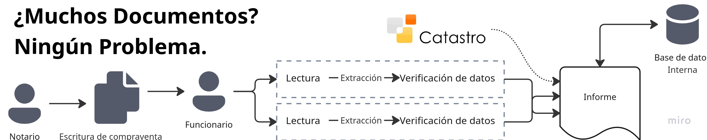

<p align="center">
  <a href="https://opensource.org/licenses/MIT">
    
  </a>
  <a href="https://www.python.org/downloads/">
    
  </a>
  <a href="https://github.com/velocitatem/accenture_mavericks/actions">
    
  </a>
</p>

### Accenture Mavericks - Document Automation System

Automate the review and cross-referencing of notary documentation for public sector entities. This system processes Spanish property transaction documents (Deed of Sale and Tax Form) to extract, validate, and compare structured data, reducing manual workload for public officials and accelerating citizen services.


### What is it?

- **Purpose**: Automate document review for notary offices in autonomous communities by extracting and cross-referencing key data from property transaction PDFs.
- **Documents**: Deed of Sale (Escritura de compra-venta) and Self-Assessment Tax Form (Modelo de liquidación 600).
- **Extracts**: Notary details, dates, property parameters (cadastral reference, address), buyer/seller identification, and facilitates capital gains tax calculation (impuesto de plusvalía).
- **Result**: Validated structured data with automated cross-referencing and discrepancy detection.

### Architecture

The system uses a multi-stage pipeline approach:

1. **OCR Layer**: Multi-provider OCR support (Mistral, Tesseract, Gemma) with configurable backends for Spanish document processing
2. **Extraction Layer**: LLM-based structured data extraction (OpenAI, CrewAI) with Pydantic validation schemas
3. **Validation Layer**: Schema validation with Spanish ID (NIF/NIE/CIF) verification and cross-document consistency checks
4. **Comparison Layer**: Automated cross-referencing between Escritura and Modelo 600 documents
5. **Caching Layer**: Redis-based distributed caching with 24-hour TTL for performance optimization

Pipeline supports both traditional sequential processing and experimental map-reduce chunking for large documents.

### Support Matrix

Current and planned provider integrations. ✅ available, 🚧 planned.

| Component | Providers | Status |
|-|-|-|
| OCR | Mistral, Tesseract, Gemma | ✅ |
| LLM Extraction | Nemotron, OpenAI | ✅ |
| Validation | Pydantic + Spanish ID | ✅ |
| Caching | Redis, In-Memory | ✅ |
| Map-Reduce | Chunked Processing | 🚧 |


### Installation

```bash
pip install -r requirements.txt
```

Environment variables (create `.env` file):

```bash
OPENAI_API_KEY=sk-... # FOR ONLINE USAGE
MISTRAL_API_KEY=... # FOR ONLINE USAGE
OLLAMA_API_KEY=... # FOR ONLINE USAGE
REDIS_HOST=localhost
REDIS_PORT=6379
```

Docker services (optional):

```bash
docker-compose up -d  # Starts Redis and other services as necessary
```

### What can I use this for?

- **Public sector document automation**: Process notary documents submitted to autonomous communities
- **Property transaction validation**: Extract and verify buyer/seller data, property details, and financial information
- **Tax calculation support**: Facilitate capital gains tax (impuesto de plusvalía) calculations with validated data
- **Document cross-referencing**: Automatically detect discrepancies between Escritura and Modelo 600
- **Multi-provider flexibility**: Switch between OCR and extraction providers based on cost/accuracy tradeoffs

### Quick Start

#### CLI Pipeline

```python
from pipeline import process_document, Escritura, Modelo600
from core.ocr import OCRProvider
from core.llm import ExtractionProvider

# Process Escritura
escritura = process_document(
    "path/to/escritura.pdf",
    doc_type=Escritura,
    ocr_provider=OCRProvider.MISTRAL,
    extraction_provider=ExtractionProvider.OPENAI
)

# Process Modelo 600
modelo600 = process_document(
    "path/to/modelo600.pdf",
    doc_type=Modelo600,
    ocr_provider=OCRProvider.MISTRAL,
    extraction_provider=ExtractionProvider.OPENAI
)

# Compare documents
from core.comparison import compare_escritura_with_tax_forms
comparison = compare_escritura_with_tax_forms({
    'escrituras': [escritura.model_dump()],
    'tax_forms': [modelo600.model_dump()]
})
```

#### Streamlit Web Interface

```bash
streamlit run src/app.py
```

Upload PDFs through the web interface for interactive processing and validation.

### Core Components

**`src/pipeline.py`** - Main orchestration with configurable provider selection
**`src/core/ocr.py`** - Multi-provider OCR with Spanish language optimization
**`src/core/llm.py`** - Structured extraction using LLM providers with Pydantic schemas
**`src/core/validation.py`** - Document validation schemas (Escritura, Modelo600) with Spanish ID verification
**`src/core/comparison.py`** - Cross-document validation and discrepancy detection
**`src/core/cache.py`** - Redis/in-memory caching with configurable TTL
**`src/eval.py`** - Evaluation metrics and ground truth comparison


### Evaluation

Run evaluation against ground truth data:

```bash
python src/eval.py
```

Evaluates extraction accuracy using token-level and field-level comparison with normalization for Spanish text (accent removal, case normalization).

### Project Structure

```
├── src/
│   ├── pipeline.py           # Main processing pipeline
│   ├── app.py                # Streamlit web interface
│   ├── eval.py               # Evaluation framework across all modalities (HIGH RUNTIME)
│   └── core/
│       ├── ocr.py            # OCR providers with image-to-text handling
│       ├── llm.py            # LLM extraction of structured outputs
│       ├── validation.py     # Pydantic schemas and processes
│       ├── comparison.py     # Document comparison in a fuzzy method
│       ├── cache.py          # Caching layer via Redis
│       └── spanish_id.py     # Spanish ID validation algorithms
├── synthetic_examples/       # Synthetic training data
├── ground-truths/            # Evaluation ground truth from original challenge
└── requirements.txt
```

### Performance

- **Caching**: 24-hour TTL with Redis backend eliminates redundant OCR/extraction
- **Multi-provider**: Switch providers based on cost/accuracy requirements
- **Parallel processing**: Optional map-reduce for large multi-page documents
- **Validation**: Early failure detection with detailed error reporting

### Contributing

This project was developed for the Accenture Mavericks challenge to modernize public sector document processing. Contributions welcome via pull requests.
